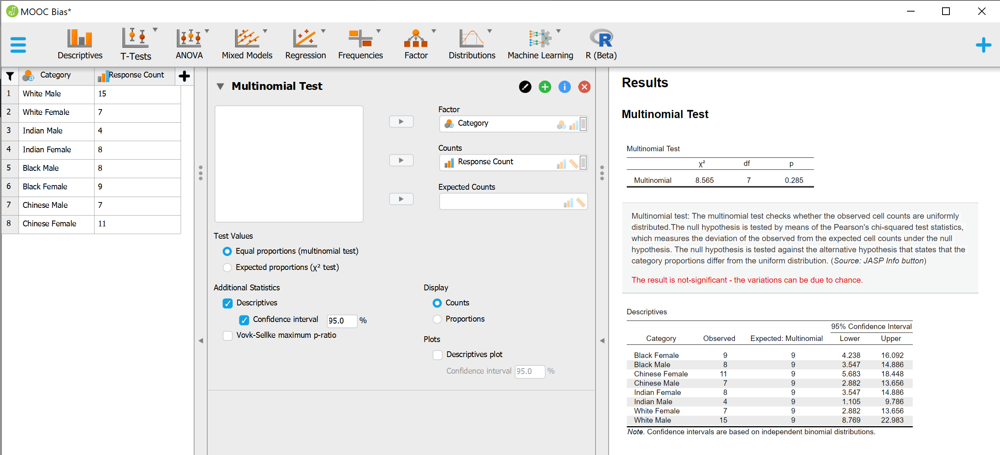

## P-value notes

- a **low p-value** can give statistical evidence to **support rejecting the null hypothesis** (however, does not prove the alt hyp is true)
- if alpha is 0.05, then 5% change of incorrectly rejecting the null hypothesis

## Chi-Squared example

