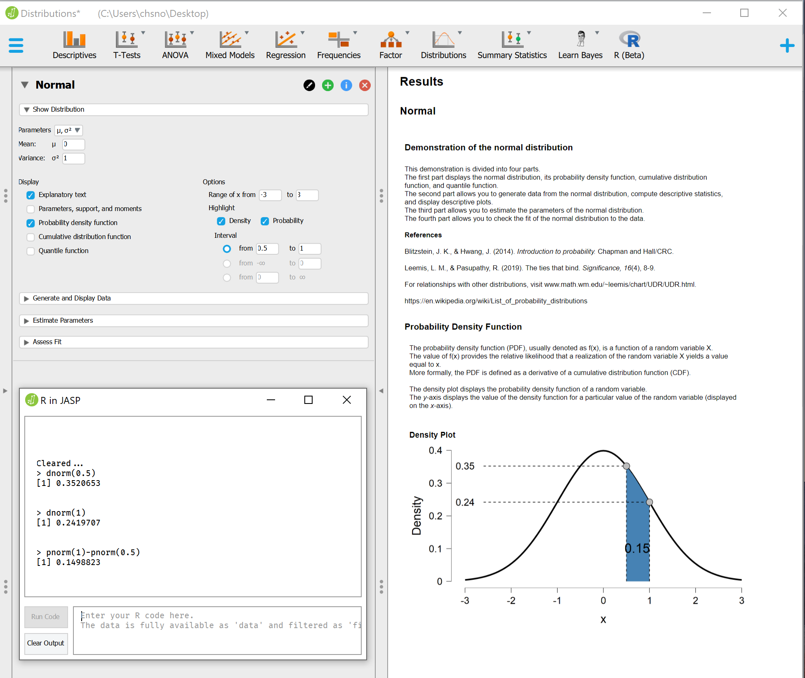
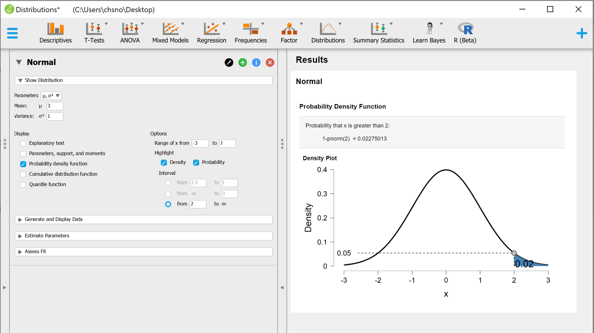
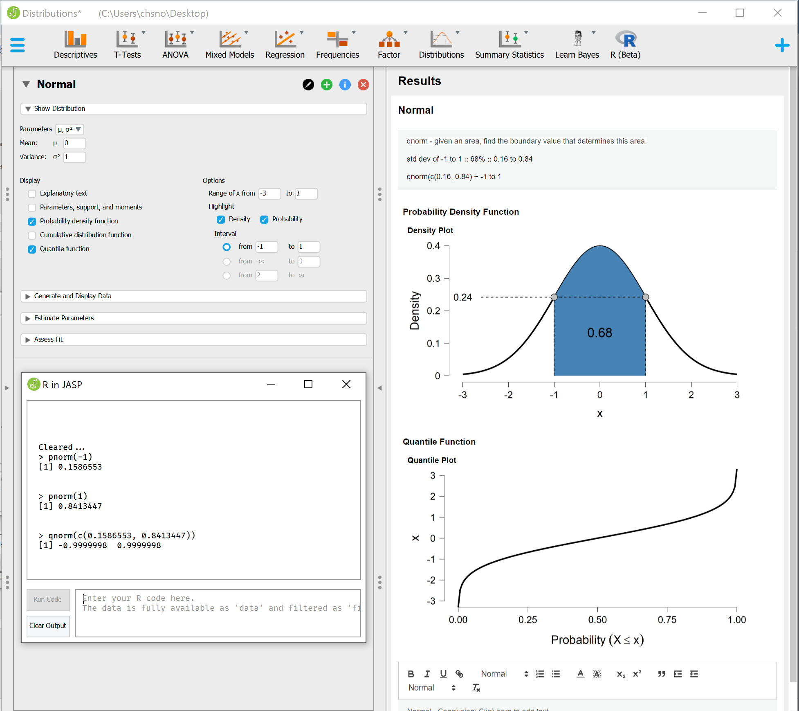

### Distributions

```
dnorm(x, mean = 0, sd = 1, log = FALSE)
pnorm(q, mean = 0, sd = 1, lower.tail = TRUE, log.p = FALSE)
qnorm(p, mean = 0, sd = 1, lower.tail = TRUE, log.p = FALSE)
rnorm(n, mean = 0, sd = 1)
```

 - **d**norm gives the density. *what's the probability the outcome will be x?*
 - **p**norm gives the distribution function. *what's the probability value will be less than x or between x and y?*
 - **q**norm gives the quantile function. *what value does x percent of the population fall between?*
 - **r**norm generates random deviates. 

[Examples](http://statweb.stanford.edu/~susan/courses/s141/Rlab2sol/)
---
### PDF




### CDF

The cumulative probability plot displays the **cumulative** distribution of a random variable.

### Quantile


