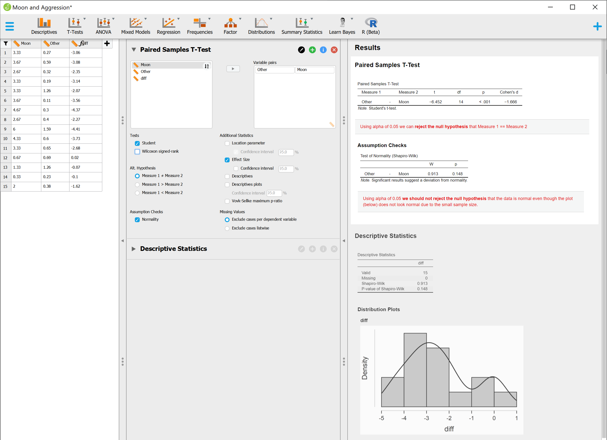
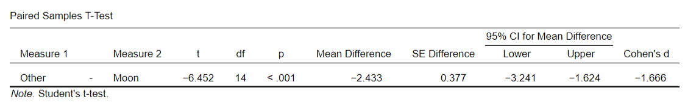

### P-value

- a **low p-value** can give statistical evidence to **support rejecting the null hypothesis** (however, does not prove the alt hyp is true)
- if alpha is 0.05, then 5% change of incorrectly rejecting the null hypothesis
- Shapiro-Wilk (normality test) - null hypothesis is that the population is normally distributed
  - If data is not normal (p < 0.05) these are non-parametric equivalents of Student test:
    - Mann-Whitney test (independent groups)
    - Wilcoxon signed rank test (related groups)
- Effect size
  - benchmarks: **small (d = 0.2)**, **medium (d = 0.5)**, and **large (d = 0.8)**
  - is measured in terms of the number of standard deviations the means differ by

### Paired Samples T-Test Example

In the analysis below:

 - the null hypothesis (moon vs other behavoir is the same) - **p < 0.001** so we reject the null hypothesis
 - the Shapiro-Wilk null hypothesis is that the data is normally distributed - **p = 0.148** so we do not reject the null hypothesis
 - the effect size is large 

- See [also](https://stats.stackexchange.com/questions/502637/p-value-for-shapiro-wilk-is-high-but-data-doesnt-appear-normal)

----

### Two other ways to verify significance:

#### CI interval should not contain zero

  - If the confidence interval (with your chosen level of confidence) includes zero, that implies you think zero is a reasonable possibility for the true value of the difference. In general, by 'significant' people usually mean that they no longer believe the null hypothesis (zero) is a reasonable possibility. Note that if a  CI doesn't include zero, the p-value would be <.05, which is the conventional cutoff for 'significance' - [source](https://stats.stackexchange.com/a/120952/48448) 

